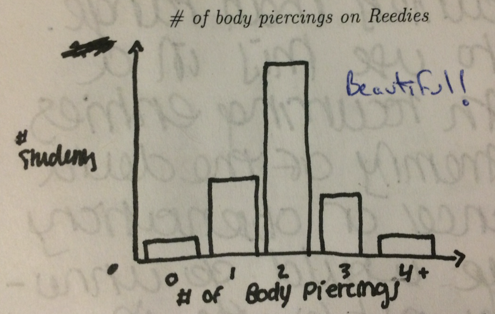
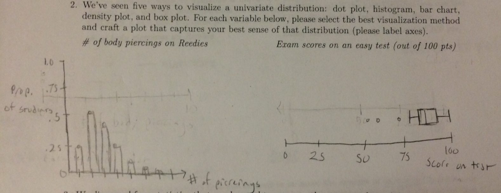
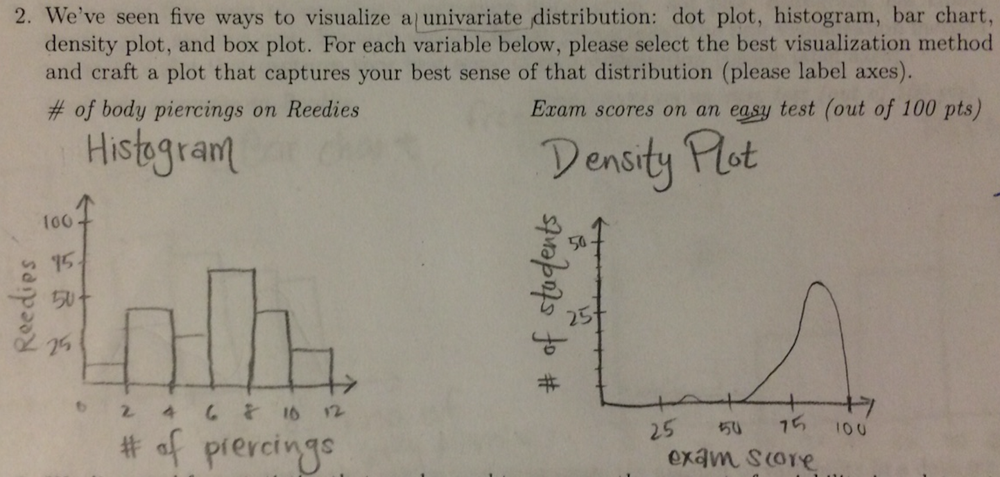

```{r setup, include=FALSE}
library(knitr)
options(digits=2)
knitr::opts_chunk$set(echo = TRUE)
library(dplyr)
library(ggplot2)
```

# Quiz Review


## Question 2




## Question 2




## Question 2




## Question 3 {.build}

The most common answer:

\[ \frac{1}{n} \sum_{i = 1}^{n} (x_i - q_{.5})^2 \]


Other creative answers:

- "modal range": \[ mode_{upper\,quartile} - mode_{lower\,quartile}\]
- meta-variance: take the mean of the variance, sd, IQR, and range
- look at the max height of the density plot
