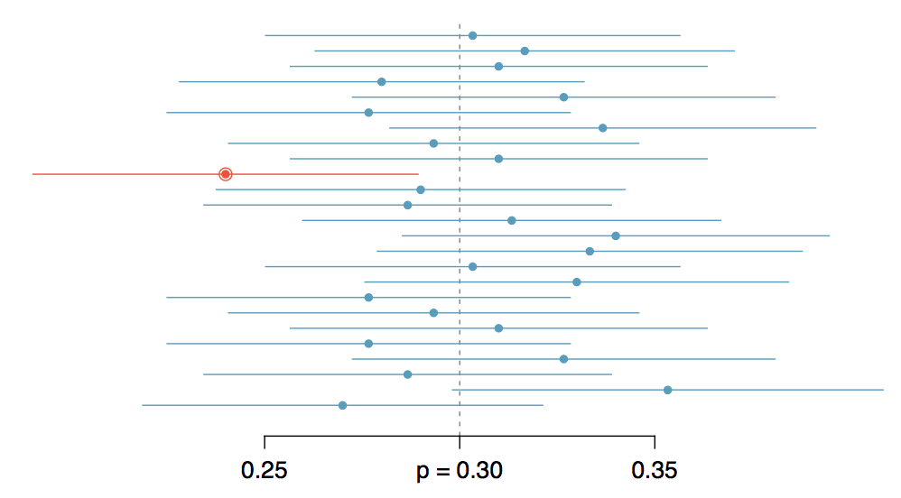
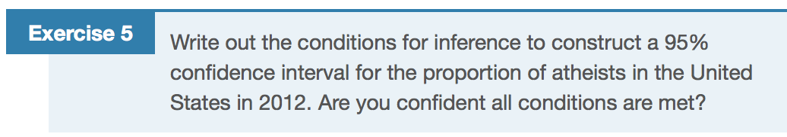

```{r setup, include=FALSE}
library(knitr)
options(digits=3)
knitr::opts_chunk$set(echo = TRUE)
library(dplyr)
library(ggplot2)
library(oilabs)
```


## {.flexbox .vcenter}

<center>

</center>


## Checking Conditions{.build}
<center>

</center>

<br />  
  
The Central Limit kicks in when

1. Observations are independent
2. The number of expected successes and failures is less than 10.

$$
np \ge 10 \\
n(1 - p) \ge 10
$$

## Constructing a CI {.build}

```{r makeus12, echo = FALSE}
us12 <- 
  atheism %>% 
  filter(nationality == "United States" & year == "2012")
```

```{r construct}
n <- length(us12$response)
p_hat <- 50/1002
n * p_hat
SE <- sqrt((p_hat * (1 - p_hat)) / n)
z_star <- qnorm(.025) # for a 95% CI
z_star
MoE <- z_star * SE
c(p_hat - MoE, p_hat + MoE)
```


## {.build}

```{r ciforus, fig.height=4}
inference(y = us12$response, est = "proportion", type = "ci", 
          method = "theoretical", success = "atheist")
```


