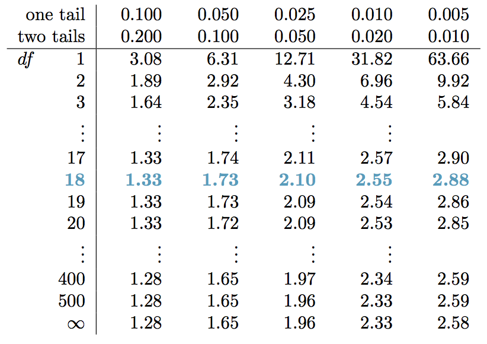
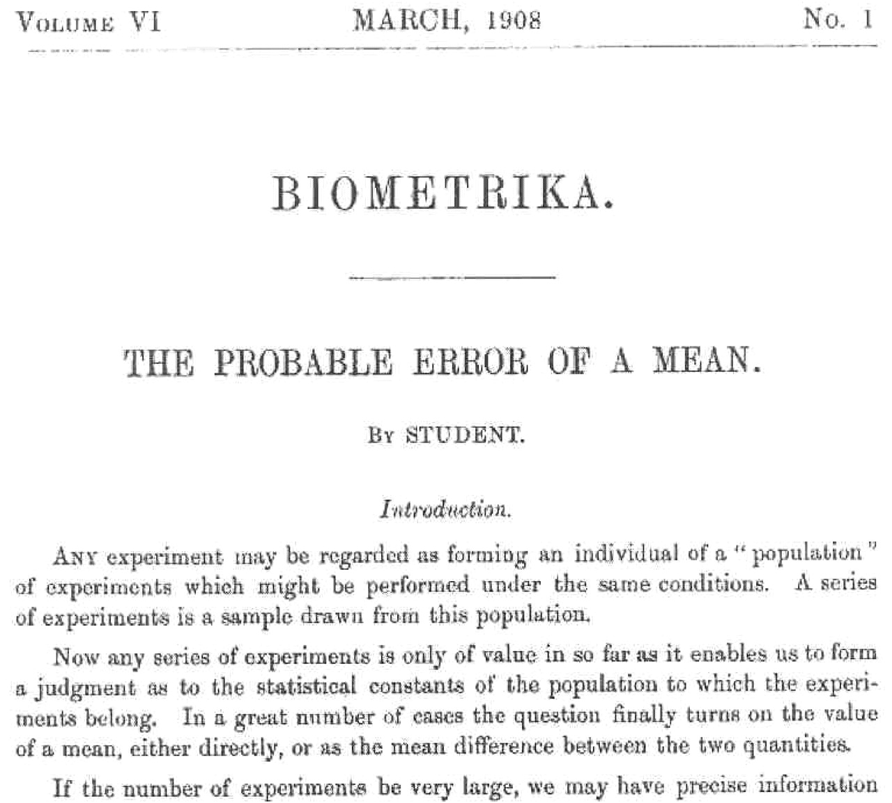

```{r setup, include=FALSE}
library(knitr)
options(digits=3)
knitr::opts_chunk$set(echo = TRUE)
library(dplyr)
library(ggplot2)
library(oilabs)
```

## The $t$ distribution {.build}

Used to estimate the mean when you have a small sample drawn from a nearly
normal population.

### Conditions
- Independent observations ($n < .1N$)
- Nearly normal population distribution (check distribution of sample)


## $t$ versus normal {.flexbox .vcenter}
```{r tdist, echo = FALSE, fig.height=4.5}
ggplot(NULL, aes(x=x, colour = distribution)) +
  stat_function(data = data.frame(x = -4:4, distribution= factor(1)), fun = dt, args = c(df = 1)) +
  stat_function(data = data.frame(x = -4:4, distribution = factor(2)), fun = dt, args = c(df = 2)) +
  stat_function(data = data.frame(x = -4:4, distribution = factor(3)), fun = dt, args = c(df = 5)) +
  stat_function(data = data.frame(x = -4:4, distribution = factor(4)), fun = dnorm) +
  scale_colour_manual(values = c("orangered4", "orangered2", "orangered", "goldenrod"),
                      labels = c("df = 1", "df = 2", "df = 5", "normal"))
```

The $t$ has heavier tails than the normal distribution.


## Degrees of Freedom {.build}
*The number of parameters that are free to vary, without violating any constraint imposed on it*.

### Parameters
$\mu$

<br/>

Since $\bar{x} = \frac{1}{n}\sum_{i = 1}^n x_i$, one of our *observations* is contrained, leaving $n-1$ 
that are free to vary.

$$ df = n - 1$$


## Hypothesis testing {.build}

1. State hypotheses: eg. $$ H_0: \mu = 4; \quad H_A: \mu \ne 4$$
2. Check conditions
    - Independent observations
    - Nearly normal population
3. Computer observed $t$-statistic $$ t_{obs} = \frac{\bar{x} - \mu}{s/\sqrt(n)} $$
4. Draw picture to assess where $t_{obs}$ falls in $t_{df = n - 1}$
5. Compute a two-tailed p-value
6. State conclusion


## Confidence intervals {.build}

point estimate $\pm$ margin of error

$$ \bar{x} \pm t^*_{df} \times SE $$

- $\bar{x}$: point estimate of $\mu$.
- $t^*_{df}$: critical value that leaves $\alpha$ in the tails of a $t$ with 
$df = n - 1$.
- $SE$: standard error of $\bar{x}$, $s/\sqrt(n)$.


## Finding p-vals and $t^*_{df}$ {.build}

<center>

</center>

```{r}
pt(-2.2, df = 18)
qt(.025, df = 18)
```


# Postscript

##
<center>

</center>


##
<div class="columns-2">
  <center>

</center>

Meet William Sealy Gosset.

<br/>

**Problem**: A batch of beer should have a fixed [chemical level related to barley]
in order to be of good quality. Can you test a small number of barrels and infer
if the entire batch is of good enough quality?
</div>


##
<center>

</center>


##
<center>

</center>
