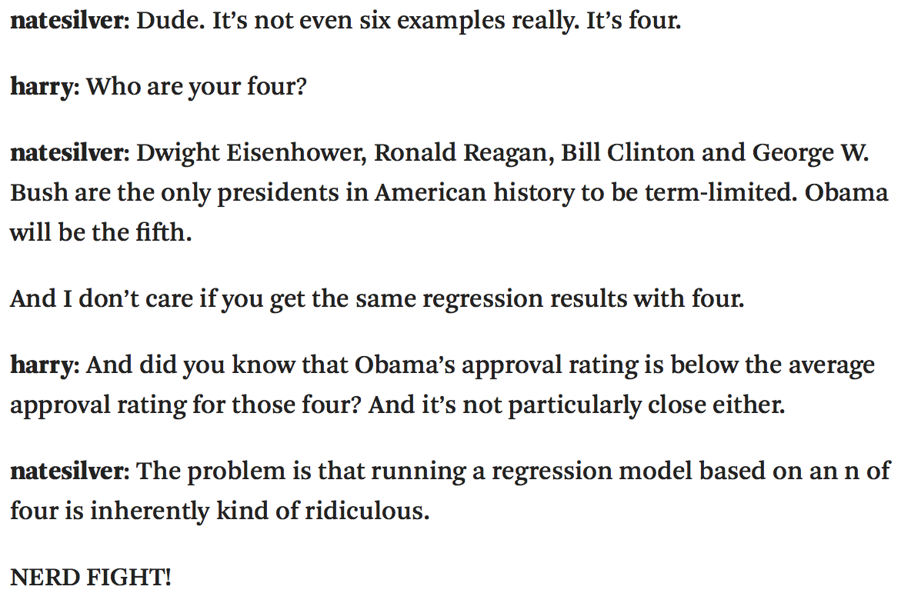

```{r setup, include=FALSE}
library(knitr)
options(digits=3)
knitr::opts_chunk$set(echo = TRUE)
library(dplyr)
library(ggplot2)
library(oilabs)
library(openintro)
```

## 2016 Election {.build}
<center>

</center>

**Question at hand**: How will Obama's 46% approval rating effect his
party's candidate for the 2016 presidential election?


##  {.build}
<center>

</center>

</br>

### Why is it ridiculous?


## Unemployment and elections {.build}
```{r echo = FALSE}
library(openintro)
data(unempl)
data(house)
data(president); pres <- president
year   <- seq(1898, 2010, 4)+1
n      <- length(year)
unemp  <- rep(0, n)
change <- rep(0, n)
presid <- rep("", n)
party  <- rep("", n)
for(i in 1:n){
	urow <- which(unempl$year == year[i]-1)
	if(i < n){
		prow <- which(pres$end > year[i])[1]
	} else {
		prow <- which(pres$potus == "Barack Obama")
	}
	hrow <- which(house$yearEnd >= year[i])[1]
	party[i] <- as.character(pres$party[prow])
	if(substr(house$p1[hrow],1,5) == substr(party[i],1,5)){
		oldHouse <- house$np1[hrow] / house$seats[hrow]
	} else {
		oldHouse <- house$np2[hrow] / house$seats[hrow]
	}
	if(substr(house$p1[hrow+1],1,5) == substr(party[i],1,5)){
		newHouse <- house$np1[hrow+1] / house$seats[hrow+1]
	} else {
		newHouse <- house$np2[hrow+1] / house$seats[hrow+1]
	}
	change[i] <- (newHouse - oldHouse)/oldHouse * 100
	presid[i] <- as.character(pres$potus[prow])
	unemp[i]  <- unempl$unemp[urow]
}

unemployPres <- data.frame(year=year, potus=presid, party=party, unemp=unemp, change=change)
unemployPres[29, 3] <- "Democratic"
```

```{r echo = FALSE}
library(dplyr)
ump <- filter(unemployPres, unemp < 15)
m0 <- lm(change ~ unemp, data = ump)
qplot(x = unemp, y = change, col = party, data = ump) +
  geom_abline(intercept = m0$coef[1], slope = m0$coef[2])
```

Some evidence of a negative linear relationship between unemployment level
and change in party support - or is there?


## H-test for Regression {.build}

$H_0:$ There is no relationship between unemployment level and change in 
party support.

$$ H_O: \beta_1 = 0 $$

$$ H_A: \beta_1 \neq 0 $$

### Method

- Randomization
- Mathematical Approximation ($t$)


## H-tests for regression {.smaller}

```{r}
m0 <- lm(change ~ unemp, data = ump)
summary(m0)
```


## H-tests for regression {.build}

- Each line in the summary table is a hypothesis test that the parameter is zero.
- Under certain conditions, the test statistic associated with $b$'s is distributed 
like $t$ random variables with $n - p$ degrees of freedom.

$$ \frac{b - \beta}{SE} \sim t_{df = n - p}$$

```{r}
t_stat <- (-1.0010 - 0)/0.8717
pt(t_stat, df = 27 - 2) * 2
```


## Question {.build}

What do you expect a 95% CI for the slope to look like?

1. $\beta_1 \pm \frac{b_1 - \beta}{SE}$
2. $b_1 \pm 1.96 \times SE$
3. $b_1 \pm t^* \times SE$
4. $\pm \frac{b_1 - \beta}{SE}$


## CI for regression {.build}

As in every CI, the form will be:

$$ \textrm{point estimate} \pm t^* \times SE $$
$$ b_1 \pm t^* \times SE $$

- The SE is the same that shows up in `summary(m0)`.
- Find $t^*$ using a t-table with $df = n - p$ or with `qt()`.
- R will also do this in one step.

```{r ci}
confint(m0)
```


## Conditions for inference {.build}

1. **Linearity**: linear trend between $X$ and $Y$, check with residual plot.
2. **Independent errors**: check with residual plot for serial correlation.
3. **Normally distributed errors**: check for linearity in qq-plot.
4. **Errors with constant variance**: look for constant spread in residual plot.

These summarize the model we have imposed:

$$ Y = \beta_0 + \beta_1 X + \epsilon; \quad \epsilon \sim N(0, \sigma^2) $$

Also sensible to check for **influential points**.


## Residual plot {.build}

Plots (standardized) **residuals** on the y-axis and usually **fitted values** ($\hat{y}$) on the x-axis.

```{r resplot, echo = FALSE, fig.height = 3, fig.width = 5, fig.align="center"}
qplot(x = .fitted, y = .stdresid, data = m0)
```

A properly specified model should be **structureless** (linearity condition)
with **even spread around zero** (constant variance).


## QQ plot {.build}

Plots (standardized) **sample quantiles** on the y-axis and **theoretical quantiles**
on the x-axis.

```{r resplot2, echo = FALSE, fig.height = 3, fig.width = 5, fig.align="center"}
qplot(sample = .stdresid, data = m0, stat = "qq") +
  geom_abline()
```

Residuals that are nearly normal will loosely follow a line, and are a good
check that our normal error assumption is reasonable.


## Modeling unemployment and elections {.build} 
The diagnostic plots reveal that our linear regression model is **valid**.

1. **Linearity**: OK
2. **Independent errors**: OK
3. **Normally distributed errors**: OK
4. **Errors with constant variance**: OK

And the relationship doesn't appear to be **statistically significant**.

```{r lmoutput}
pt(t_stat, df = 27 - 2) * 2
```

This data provides no evidence of an association between voting patterns for
candidates from the president's party and the level of unemployment.

##  {.build}
<center>

</center>
