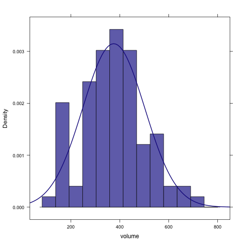
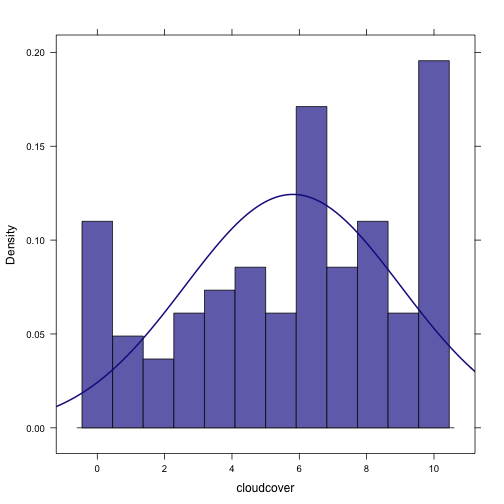
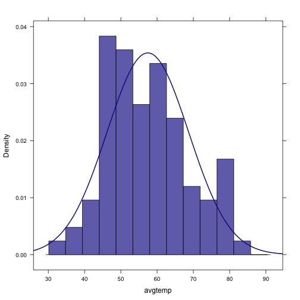
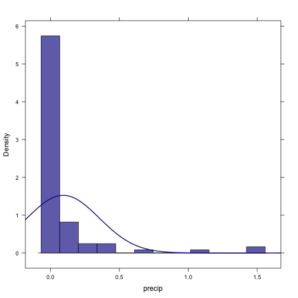
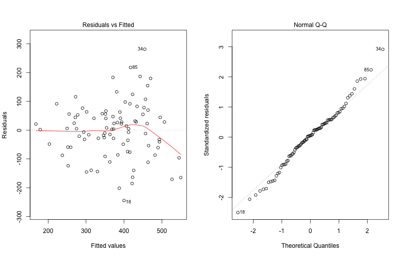

Analytic Plan Outline
========================================================

This document is intended provide an example of your Analytic Plan Outline that you'll submit by midnight on Monday, April 22nd.


#### Rail Trail 

In this example, we'll be using data from the **RailTrail** data set. We should always start by conducting some univariate analysis on the key variables in which we are interested. 


```r
require(mosaic)
trellis.par.set(theme = col.mosaic())
data(RailTrail)
head(RailTrail)
```

```
##   hightemp lowtemp avgtemp spring summer fall cloudcover precip volume
## 1       83      50    66.5      0      1    0        7.6   0.00    501
## 2       73      49    61.0      0      1    0        6.3   0.29    419
## 3       74      52    63.0      1      0    0        7.5   0.32    397
## 4       95      61    78.0      0      1    0        2.6   0.00    385
## 5       44      52    48.0      1      0    0       10.0   0.14    200
## 6       69      54    61.5      1      0    0        6.6   0.02    375
##   weekday dayofweek
## 1       1      Tues
## 2       1       Wed
## 3       1      Tues
## 4       0       Sat
## 5       1     Thurs
## 6       1       Mon
```


##### Univariate Analysis


```r
xhistogram(~volume, data = RailTrail, fit = "normal")
```

```
## Loading required package: MASS
```

 

```r
xhistogram(~cloudcover, data = RailTrail, fit = "normal")
```

 

```r
xhistogram(~avgtemp, data = RailTrail, fit = "normal")
```

 

```r
xhistogram(~precip, data = RailTrail, fit = "normal")
```

 

```r
tally(~spring + summer, data = RailTrail)
```

```
##        summer
## spring   0  1 Total
##   0     12 25    37
##   1     53  0    53
##   Total 65 25    90
```

```r
tally(~spring + fall, data = RailTrail)
```

```
##        fall
## spring   0  1 Total
##   0     25 12    37
##   1     53  0    53
##   Total 78 12    90
```


From the two tables we can tell that we have 53 observations in the spring, 25 in the summer, and 12 in the fall. 

##### Bivariate Analysis

Next we'll want to look at how are quantitative variables are related. A quick way to visualize this is with the **pairs()** command. 


```r
pairs(subset(RailTrail, select = c("volume", "cloudcover", "avgtemp", "precip")))
```

 


From this we can see that $volume$ and $avgtemp$ appear to be linearly correlated to a moderate degree, in a positive direction. Moreover, there is a mild negative relationship between $volume$ and $cloudcover$. The relationships between $precip$ and the other variables are harder to unravel, since there are so many observations with no precipitation. We might conisder recasting this as a binary variable (i.e. 0 for no precipitation, 1 for any precipitation). 

##### Regression Model

We want to understand the variation in the volume of ridership on the rail trail ($volume$), as a function of the average temperature that day ($avgtemp$), the amount of cloud cover ($cloudcover$), and the amount of precipitation ($precip$). We also want to control for the season, so we'll add indicator variables for spring and summer (note that we don't need to add $fall$, since if an observation was not in the spring or the summer, it was necessary in the fall). To do this, we'll build a multiple regression model. 


```r
fm = lm(volume ~ avgtemp + cloudcover + precip + spring + summer, data = RailTrail)
summary(fm)
```

```
## 
## Call:
## lm(formula = volume ~ avgtemp + cloudcover + precip + spring + 
##     summer, data = RailTrail)
## 
## Residuals:
##     Min      1Q  Median      3Q     Max 
## -244.18  -57.70    4.97   55.54  281.09 
## 
## Coefficients:
##             Estimate Std. Error t value Pr(>|t|)    
## (Intercept)    75.32      78.77    0.96  0.34171    
## avgtemp         6.62       1.59    4.17  7.3e-05 ***
## cloudcover    -14.09       3.50   -4.02  0.00013 ***
## precip       -112.80      45.02   -2.51  0.01416 *  
## spring         23.01      34.70    0.66  0.50911    
## summer         -5.25      55.40   -0.09  0.92470    
## ---
## Signif. codes:  0 '***' 0.001 '**' 0.01 '*' 0.05 '.' 0.1 ' ' 1 
## 
## Residual standard error: 98.9 on 84 degrees of freedom
## Multiple R-squared: 0.431,	Adjusted R-squared: 0.398 
## F-statistic: 12.8 on 5 and 84 DF,  p-value: 3.18e-09
```


We see that indeed the volume of ridership seems to be associated with the average temperature, cloud cover, and the amount of precipitation. The effects of the seasons are a bit muddled, as they statistical evidence for a seasonal effect is weak. Note that higher temperatures are associated with greater ridership, but precipitation and cloud cover are associated with a decrease in ridership. Our model was able to explain about 43% of the variation in ridership, which is not bad considering the complexity of the problem! 

We'll need to compute confidence intervals for our coefficients. 


```r
confint(fm)
```

```
##                2.5 %  97.5 %
## (Intercept)  -81.318 231.952
## avgtemp        3.464   9.777
## cloudcover   -21.054  -7.118
## precip      -202.325 -23.274
## spring       -46.001  92.022
## summer      -115.411 104.908
```


Thus, our model finds that after controlling for cloud cover, precipitation, and season, each additional degree of the average temperature is associated with an average increase of between 3.5 and 9.8 riders.  

On a spring day like today, with temperatures of about 62 and blue skies, we estimate the number of riders to be about:


```r
fit.riders = makeFun(fm)
fit.riders(avgtemp = 62, cloudcover = 0, precip = 0, spring = 1, summer = 0)
```

```
##     1 
## 508.8
```


##### Residual Analysis

In the residual plots below, we can see that except for a few days with very high ridership, there is little pattern to the residuals. However, our model did considerably overestimate the ridership on a few nice days, suggesting that our model may be as  accurate for warm, sunny days. Also, we do have some evidence of non-constant variance (heteroskedasticity), since the variation in the residuals seems to be higher for days with more ridership than for days with less ridership. While the residuals are approximately normally distributed, there is some evidence of right skew. 


```r
xhistogram(~resid(fm), fit = "normal")
```

 


```r
par(mfrow = c(1, 2))
plot(fm, which = c(1, 2))
```

 

```r
par(mfrow = c(1, 1))
```


##### Conclusion

We've determined that the average temperature of a day is an important factor that is associated with the number of riders on the Rail Trail. In particular, we determined that the average increase in ridership associated with each additional degree of temperature was between 3.5 and 9.8, after controlling for the effects of cloud cover, precipitation, and season. 

