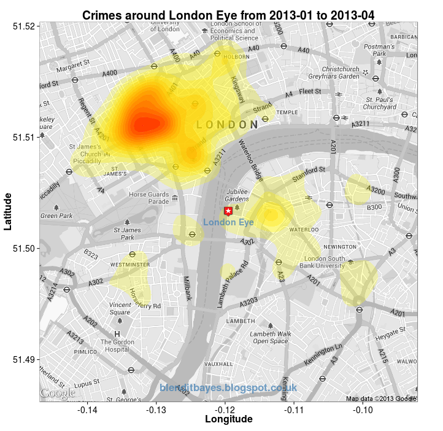
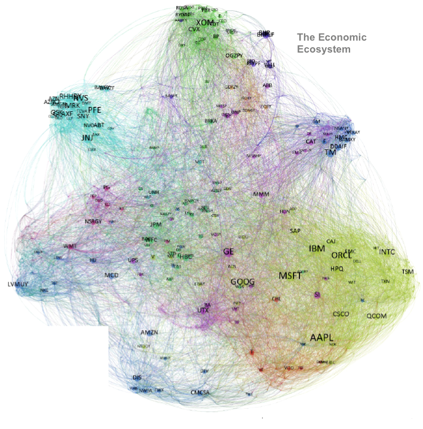
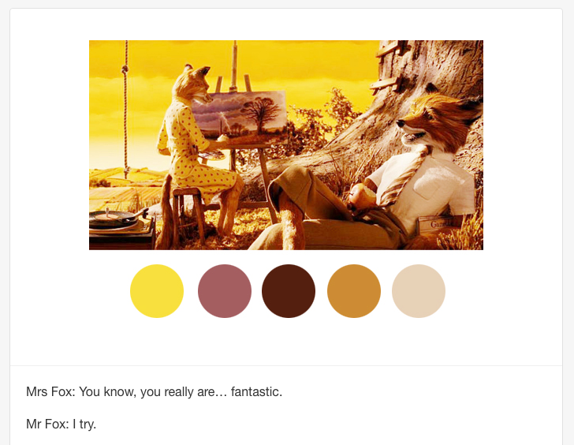

Intro to R and RStudio
========================================================
incremental: true

Three Key Principes
========================================================
- **Object:** Everything that exists is an object
- **Function:** Everything that happens is a function call
- **Interface:** R is built on interfaces to many algorithms


R is free and open source
========================================================

**Free:** Free. Base R is maintained by about 20 volunteers.

But what is meant by **Open source**?

- Anyone can access the source code.
- Anyone can modify the source code.
- Anyone can expand R by writing their own *package* and host it on CRAN.


Package: ggmap
========================================================



Package: igraph
========================================================



Package: wesanderson
========================================================



RStudio
========================================================
type: section


RStudio
========================================================
An Integrated Development Environment (IDE) for R.  Free and open source.

Four panes:

1. Source
2. Console
3. Environment
4. Files/plots/help


========================================================
type: prompt
RStudio is also fairly customizable.

Please go in and change your settings so that you're using a color scheme that
is different than the default one.


R Basics
========================================================
type: section


R is a calculator
========================================================
- You can `+`, `-`, `/`, `*`.
- You can save objects.
- Spaces don't matter.


Vectors
========================================================
type: section


Vectors
========================================================
*"Everything is a vector"*

...including scalars, matrices, arrays.


Must be of the same mode:

- integer
- numeric (fp)
- character (string)
- logical (boolean)
- complex

...except for `NA`.


Generating Vectors
========================================================
type: section


Generating Vectors
========================================================


```r
v <- 7
v
```

```
[1] 7
```

```r
c(1:30, v)
```

```
 [1]  1  2  3  4  5  6  7  8  9 10 11 12 13 14 15 16 17 18 19 20 21 22 23
[24] 24 25 26 27 28 29 30  7
```

```r
l <- c("a", "b", "c", "d")
c(l, v)
```

```
[1] "a" "b" "c" "d" "7"
```


: operator
========================================================


```r
5:8
```

```
[1] 5 6 7 8
```

Watch for order of operations.


```r
i <- 5
1:i - 1
```

```
[1] 0 1 2 3 4
```

```r
1:(i - 1)
```

```
[1] 1 2 3 4
```


seq() and rep()
========================================================

```r
seq(5, 8)
```

```
[1] 5 6 7 8
```

```r
seq(10, 20, 5)
```

```
[1] 10 15 20
```

```r
rep(5, 8)
```

```
[1] 5 5 5 5 5 5 5 5
```

```r
rep(1:5, 2)
```

```
 [1] 1 2 3 4 5 1 2 3 4 5
```


Vector Operations
========================================================
type: section


Vector Math
========================================================

```r
x <- c(1, 2, 4)
y <- c(1, 2, 1)
x + y
```

```
[1] 2 4 5
```

```r
x + 1
```

```
[1] 2 3 5
```


Vector Math
========================================================

```r
x * y
```

```
[1] 1 4 4
```

```r
x %*% y
```

```
     [,1]
[1,]    9
```


Vector Indexing
========================================================
Use square brackets to pick out sub-vectors.


```r
letters[1:4]
```

```
[1] "a" "b" "c" "d"
```

```r
letters[c(1, 3)]
```

```
[1] "a" "c"
```

```r
z <- c(1, 3, 7)
z[-1]
```

```
[1] 3 7
```


Vector Indexing
========================================================
type: prompt

Consider the vector `x <- c(12,15,8,11,24)`.  How do we create a vector of the
differences between adjacent elements?


```r
x <- c(12, 15, 8, 11, 24)
x[-1] - x[-length(x)]
```

```
[1]  3 -7  3 13
```

Work in vectors instead of loops where possible.
